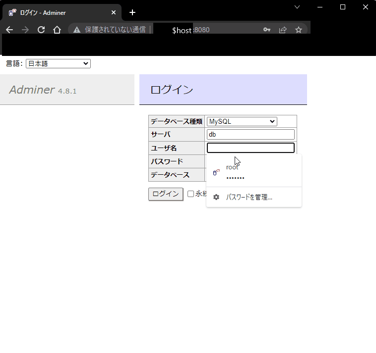
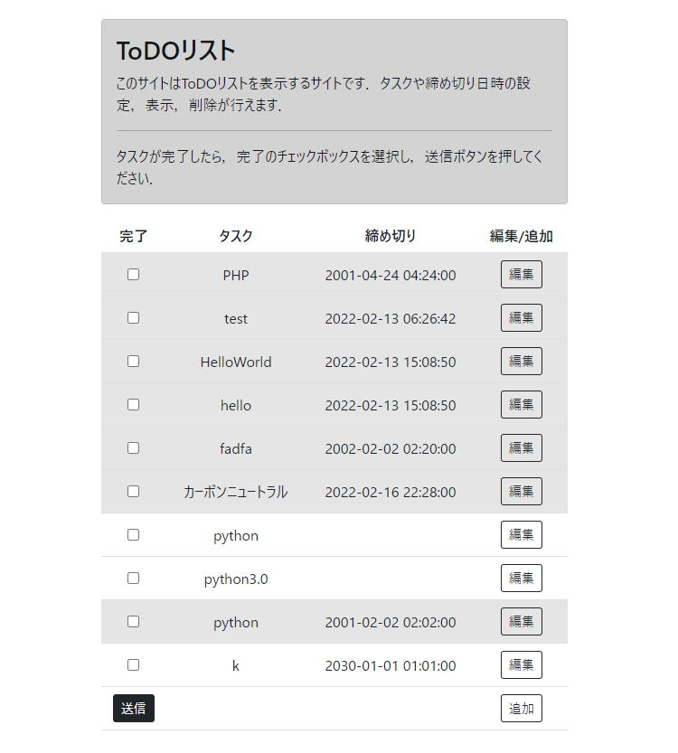
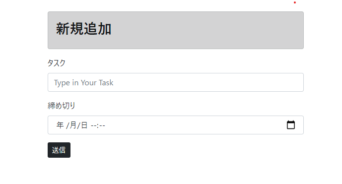
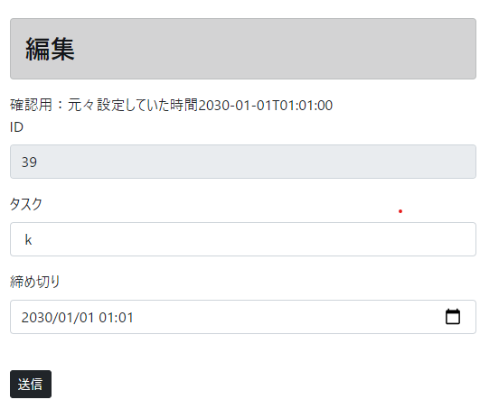
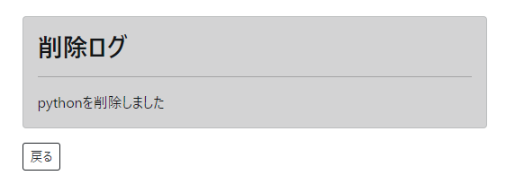

<h1>ToDOリスト</h1>
<h3>2022年2月17日更新</h3>
<ul>
    <li>readme.MDを更新しました</li>
</ul>

# DEMO


 
# NextStage

* このドキュメントに動画を加える！ 


# Requirement

"hoge"を動かすのに必要なライブラリなどを列挙する
 
* Docker version 20.10.12, build e91ed57
* docker-compose version 1.25.0, build unknown
* Docker-images:
    php:7.4-apache,mysql
* baseServer:ubuntuserver20.04.3x64,IntelArc
 
# Installation
* インストール方法

```bash
cd ToDOlist
docker-compose up -d
```
http://(host):8080にアクセス<br>
該当ページは以下でアクセス．
* データベース種別:MySQL
* サーバー:db
* ユーザー名:root
* パスワード:example
* データベース:空欄<br>
左サイドバーのインポート>"todo.sql.gz"のファイルをインポートする．<br>
### 接続方法



 
# Usage
* (host) = 自分のIPアドレス or DNS <br>
http://(host)/todo.php
にアクセスする<br>
### ホーム画面

### 編集

### 新規追加

### 削除



# Note
 
注意点などがあれば書く
現段階では試用版です．
本ソフトを利用していかなる損害が発生しても当方は責任を負いません．
 
# Author
 
作成情報を列挙する
 
* 作成者:Amembo
* E-mail:
c0b20140d0@edu.teu.ac.jp 
